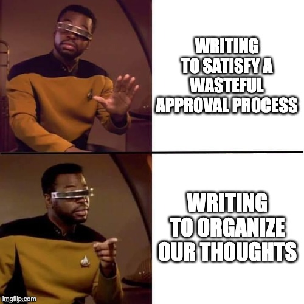

# Architectural Decision Records

Writing down the stuff we can't document in code.

---

---

## Code doesn't say why

---

## What goes into an ADR?

- Summary
- Context
- Decision
- Consequences

---

## The important part

- ~~Summary~~
- Context
- ~~Decision~~
- ~~Consequences~~

---

## Summary

A title that we can use when talking about the decision

E.g. "Share no CSS with core Centralus"

---

## Context
#### The facts which make the decision obvious

- big picture goals
- what you tried
- constraints
- opinions
- instincts

---

## Decision

One or two sentences that precisely state the decision.

Basically, it's the Summary with a few precise details

---

## Consequences

- Answers "so what?"
- downsides
- upsides

---

## When We Use ADRs

1. document the "why" for decisions we make together
2. share the results of learning time research

---

## Why We Use ADRs

1. So we don't have to remember "why did we decide this?"
    - visitors or new team members ask "Why"
    - there is a reason
    - what was the reason?
    - if it's in an ADR, we don't have to remember, we just read

---

## Why We Use ADRs

1. So we don't have to remember "why did we decide this?"
2. To clarify our thoughts
   - The exercise of writing an ADR helps us think clearly
   - It is a conversation facilitator for us to make decisions together
   
---

## Why We Use ADRs

1. So we don't have to remember "why did we decide this?"
2. To clarify our thoughts
3. To democratize decision-making
    - We want the freedom to do solo research in learning time
    - Often, that means ruling out alternatives
    - a "Pending" ADR is a nice way to communicate the back-story
    - it's intimidating to remember and explain the research verbally
      - sharing an ADR is less intimidating

---

## ADR Bottom Line

- More writing
- Less remembering
- Reduced cognitive load
