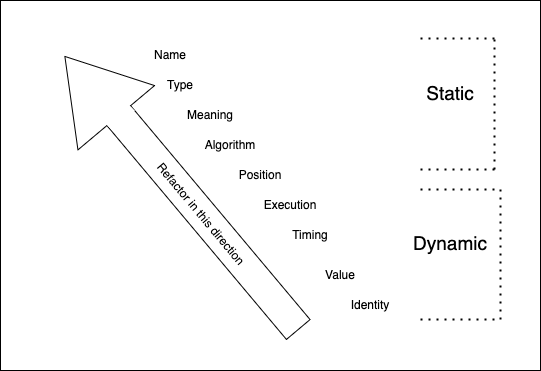

# So many ways to couple!

---

## Coupling

Two things are coupled if a change to one requires a change together

---

## Too much coupling is bad

If everything is coupled to everything then we can't change anything without changing everything

---

## We sell coupling

If there is no coupling, there is no software.

Coding is coupling.

---

## Couple wisely

Since coupling costs, but we sell coupling, then let's make good choices about what we couple together

---

## Types of coupling

- We'll go over a bunch
- Rule of thumb: the ones I cover first are less problematic
  - refactor towards the first ones

---

## From "Building Evolutionary Architectures"

From Chapter 5, section "Connascence"


---

## Static vs Dynamic

- **static** coupling refers to coupling in the code
- **dynamic** coupling refers to coupling in runtime behavior

---

# Static: Name Coupling

```typescript
function cleanHat() {
  findHat();
}

function findHat() {
}
```

If you rename `findHat()`, you must update `cleanHat()` or the code won't compile

---

# Static: Type Coupling

```typescript
function printThisNumber(toPrint: number) {
  // ...
}

function main() {
  printThisNumber(42);
}
```

If you change the type of `toPrint` to a string, then you must update `main` or the code won't compile

---

# Static: Meaning Coupling

Currently, "day 0" means "irrigate once".

```typescript
function scheduleIrrigation(day: number) { /* ... */ }

function main() {
  scheduleIrrigation(0);
}
```

If we change the firmware so "day 0" to mean "irrigate every day", then our code still compiles but we will have a problem at runtime unless we also change `main`.

---

# Static: Position Coupling

```typescript
function buyAnimals(mice: number, whales: number) {
  // ...
}

function main() {
  buyAnimals(40, 2);
}
```

If we swap the parameters in `buyAnimals`, our code will compile even if we don't change `main`... but we will end up with way too many whales and not nearly enough mice.

---

# Static: Algorithm Coupling

```typescript
// client
function sendToServer(payload: Payload) {
  http.post('/data', JSON.stringify(payload));
}

// server
function handlePostData(request: HttpRequest) {
  const data = CSV.parse(request.body);
}
```

If the client encodes JSON but the server expects CSV, the system won't work. The serialization/deserialization algorithms are coupled.

---

# Dynamic: Order Coupling

```typescript
const email = new Email();
email.setRecipient('foo@example.com');
email.setSender('me@me.com');
email.send();
email.setSubject('too late');
```

The methods have execution coupling because they must be called in a certain order

---

# Dynamic: Timing Coupling

```typescript
// Runs when the app starts
loadData().then(data => {
  globalState.data = data;
})

// One page of the app
function render() {
  this.title = globalState.data.title;
}
```

If that page loads before the data is set, we will have no title. The code is apparently independent but there is dynamic coupling between these parts of the code.

---

# Dynamic: Value Coupling

```typescript
const buyerAccount: BankAccount = getBankAccount(buyerUserId);
const sellerAccount: BankAccount = getBankAccount(sellerUserId);

buyerAccount.withdraw(itemPrice);
sellerAccount.deposit(itemPrice);
```

The buyer and seller account values must change together.

---

# Dynamic: Identity Coupling

This is like static name coupling, except it's at runtime.

Two independent systems must reference the same entity for the overall system to work. Example:

- Configure your SSO provider to redirect to `yourwebsite.com?authToken=$TOKEN` after a successful authentication
- Your app code must read the query parameter named `authToken`

---

# So many ways to couple!

So what do we do with this list of coupling types?

---

# Bring the pain forward

- static is less scary than dynamic
- of the static coupling, the ones the compiler catch are less scary

---



---

## Bottom Line

If A and B are coupled (changing one requires changing the other)

Then refactor so the compiler forces me to make A and B fit together
