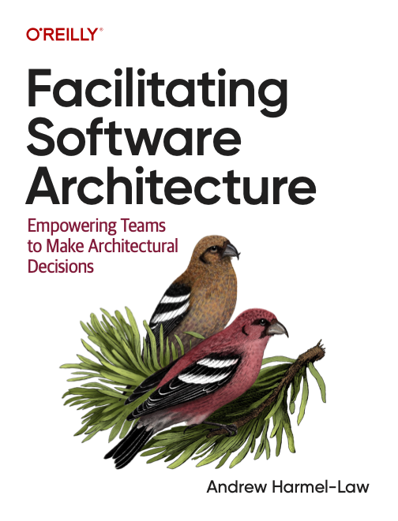
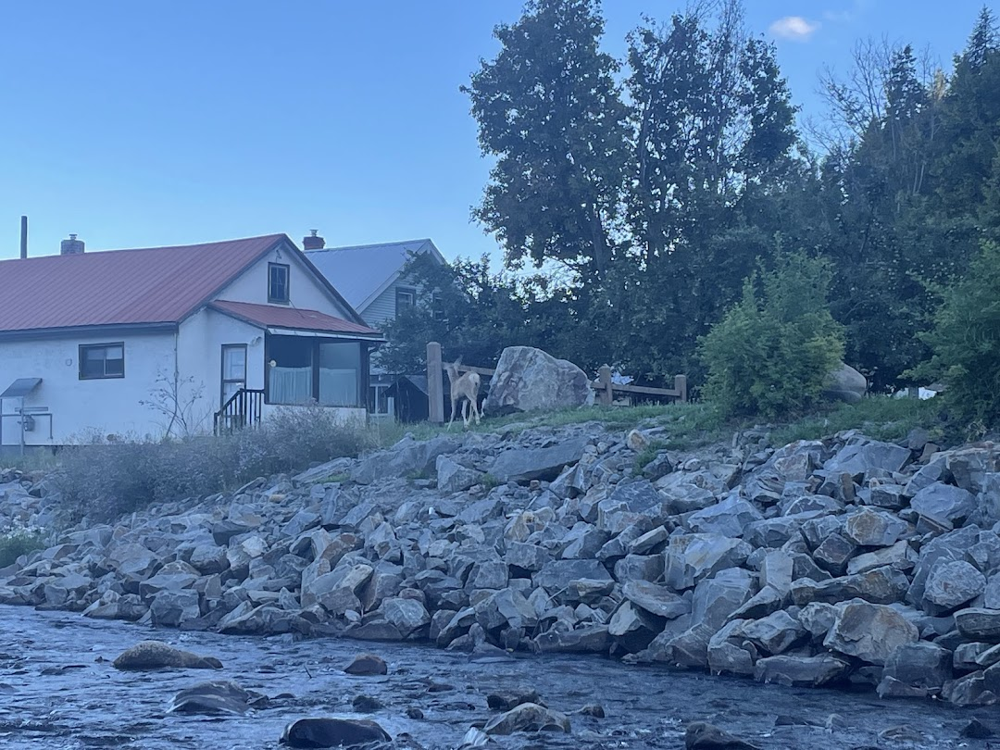

# Deciding Together
### How we design the stuff we build

---

# Notes&nbsp;&nbsp;&nbsp;&nbsp;&nbsp;&nbsp;&nbsp;&nbsp;&nbsp;&nbsp;&nbsp;&nbsp;&nbsp;&nbsp;&nbsp;&nbsp;&nbsp; While Reading

**Facilitating Software Architecture:** Empowering Teams to Make Architectural Decisions

---

# Why?

To get better at **making decisions**

That are:

- Good
- Fast
- Collaborative

---

## In our department, we are good at

Not blocking progress while waiting on "The Architect" to decide for us

---

## In our department, we are good at

Not letting faraway folks from making "architecture" decisions that are out of touch with reality -- we decide for ourselves, and we know the details because we live in the details

---

## In our department, we are good at

When the decision only affects our team,

We make **good**, **fast**, **collaborative** decisions

---

## What about cross-team decisions?

How do we decide when there are multiple teams that will be impacted?

---

## How do we make cross-team decisions?

Here are some patterns

These are reductive models -- it's not as black and white as this

---

## How do we make cross-team decisions?
### First team chooses

Whichever team arrives at the need for the decision first makes the decision.

|               |   |
|---------------|---|
| Good          | ❌ |
| Fast          | ✅ |
| Collaborative | ❌ |

---

## How do we make cross-team decisions?
### Consensus

Gather everyone together and chat until we agree.

|               |   |
|---------------|---|
| Good          | ✅ |
| Fast          | ❌ |
| Collaborative | ✅ |

---

## What about cross-team decisions?
### Chris

Let Chris make the call.

|               |   |
|---------------|---|
| Good          | ❓ |
| Fast          | ❌ |
| Collaborative | ❌ |

It might or might not be good, depending on whether Chris has enough context

It might or might not be fast, depending on whether Chris happens to be available

---

## So what does Andrew Harmel-Law suggest?

> The "Architecture Advice Process"

---

## The Architecture Advice Process

> **Anyone** can take and communicate an architectural decision as long as **during the option-making stage**, they **seek advice** from
> - everyone who will be **meaningfully affected** by the decision
> - people who have **expertise in the area** in which the decision is being taken

---

## The Architecture Advice Process

This opens up some questions:
- what decisions count as "architectural"?
- how do we identify who will be affected by the decision?
- how do we identify who has relevant expertise?
- how do we communicate these decisions?

---

## Next steps
### Discussing "Facilitating Software Architecture"

Next week in the continuous improvement LII we're discussing a few chapters of the book

 - What makes a decision "architectural"?
 - An overview of standard decision-making processes, with their pros and cons

If you're interested, please join us!

---

## TL;DR

1. When you notice you're about to decide something that impacts another team by
   - making their life more difficult
   - changing or constraining how they work
2. Then go chat with them, asking for advice
   - but you don't need to wait for consensus; you take the advice and then make your decision

