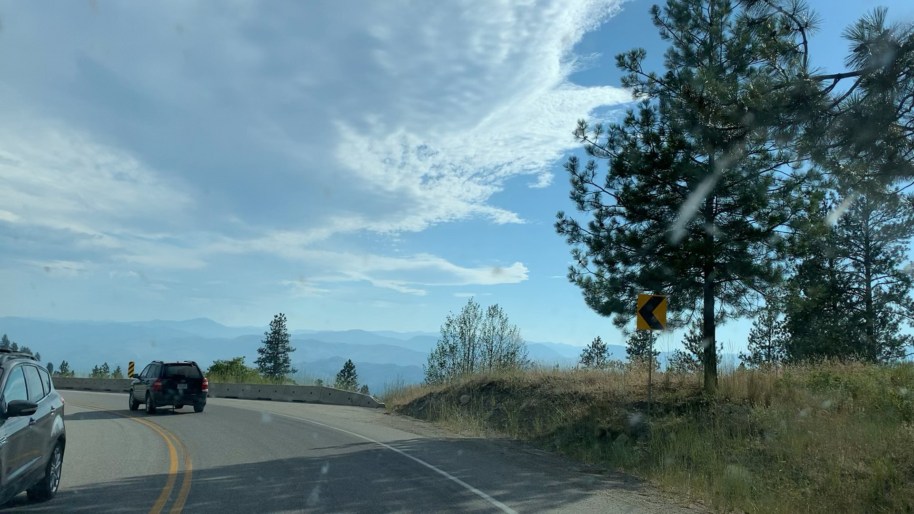
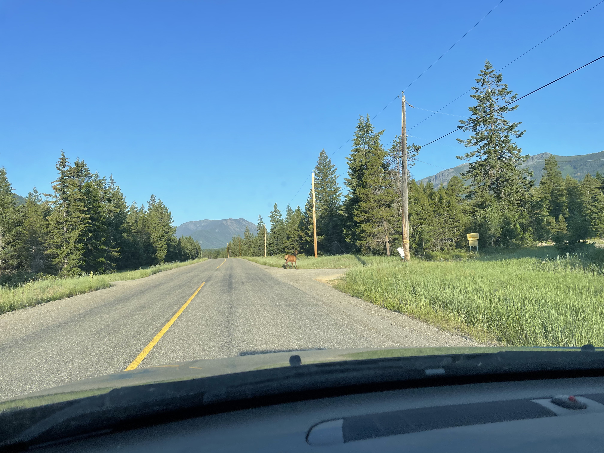
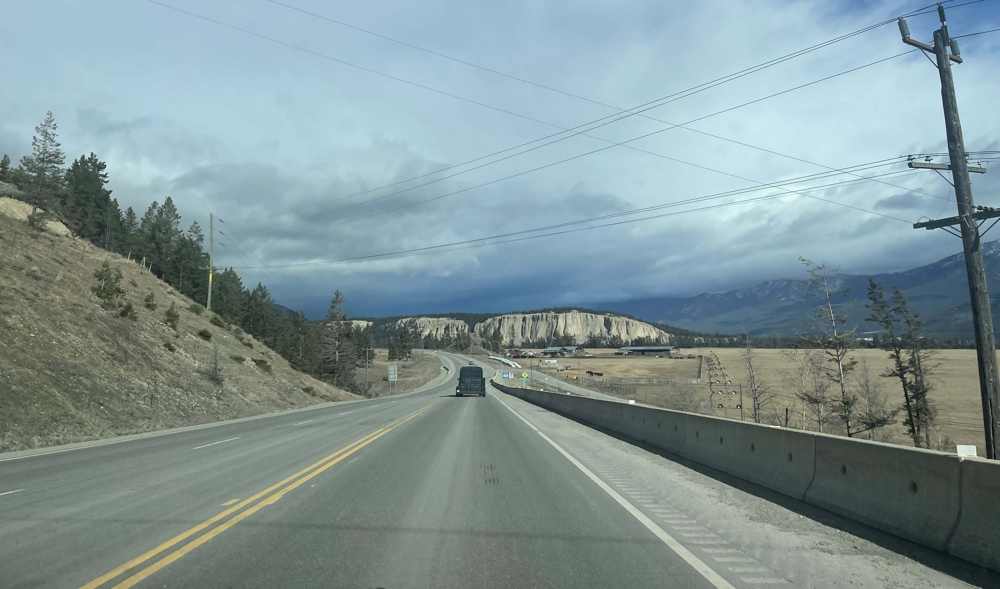
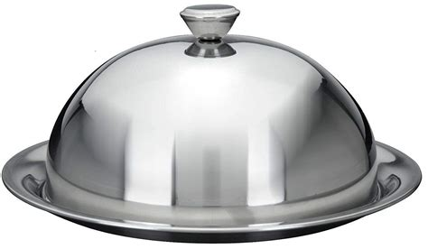
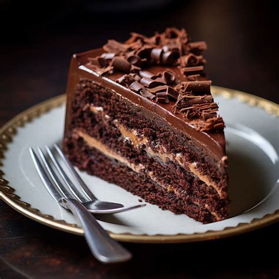
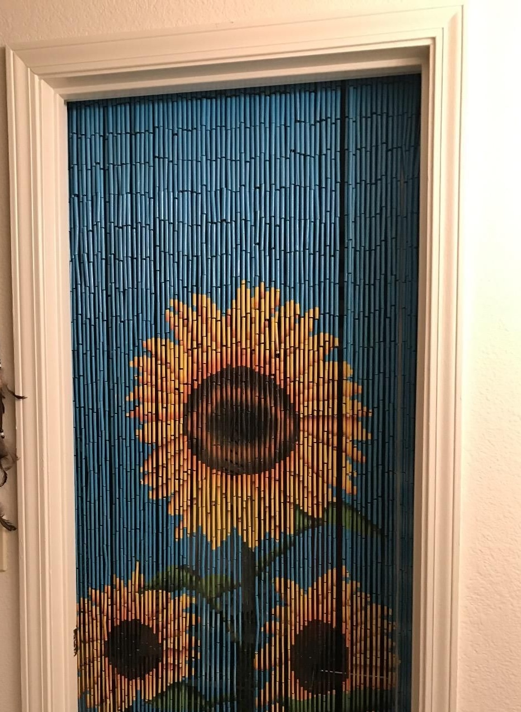
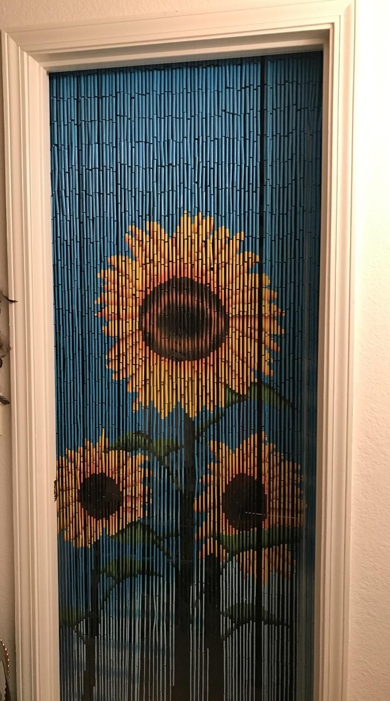
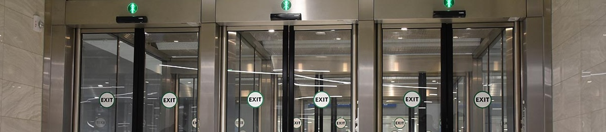
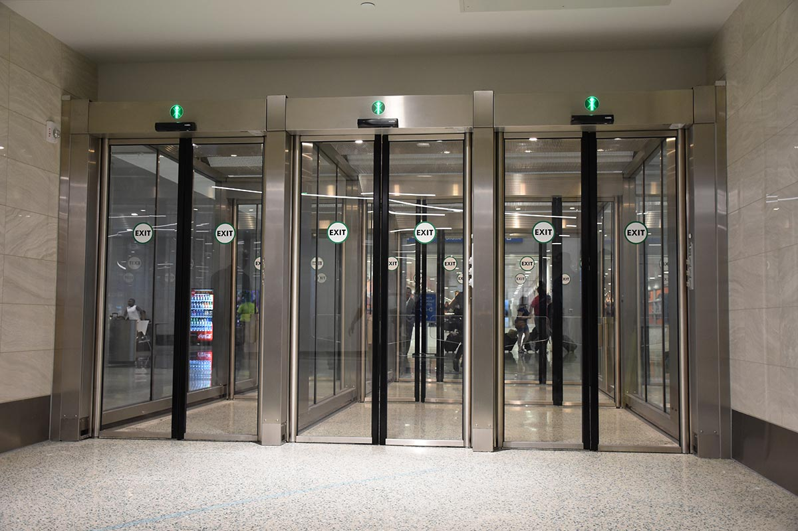
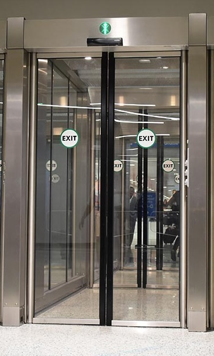

# Speeding up and slowing down

## Heuristics for when to plan less and more

---

---

---

---

---

---

---

---

# Speed by default
# Slow for hazards

---

# When to slow down?

---

# Exercise
## Choose a platter and eat what's on it

 
 
 

---

# Algorithm 1: Look Inside

 

---

# Challenge
## What if it takes some effort to investigate each option?

---

# Algorithm 2
### Explore Everything

- Easy to go through a bead door
- Explore until we find good food

---

# Challenge
## What if exploring one prevents exploring another?

---

---

# Algorithm 3
### Research

- Smell when the doors open
- Ask a passerby to check for you
- Send one person of your group through

---

 
 

<ul>
<li>Algorithm 1: Look inside each
<li>Algorithm 2: Explore everything
<li>Algorithm 3: Research
</ul>

---

## Explore everything

Works well when it's cheap to explore

---

## Research

Works well when exploring is expensive

---

## Bead Door Examples

- Choosing a library to transform data
- Class structure and naming
- UI layout

---

## One-way Door Examples

- Moving customer data into a new database
- Choosing a translation strategy and using it throughout the UI
- Setting a pattern and using it throughout the code

---

## The Planning Tradeoff

The higher the cost to explore, the bigger the budget for research

---

## Hack: make 1-way-doors 2-way

- Reduce the scope of the experiment
- Make it easy to reverse

---

## Examples: de-risking decisions

- Prove the database with sample data
- Prove the translation strategy with a small part of the UI
- Prove a pattern in a narrow scope

---

# Alex's suggestion

1. **Default to fast**: assume bead door
2. **Assess how reversible** is the decision you're about to make?
   -  And act accordingly

---

# Alex's suggestion
## When you identify a hard-to-reverse decision 

In this case, "try the first idea" won't make you faster

1. If possible, **reframe** the decision as a reversible bead door decision
2. Otherwise, take time to **plan and research** before acting

---

# Things to say in the mob

---

# Things to say in the mob

- *probing*: "If we do X, can we change our mind?"
- *gas pedal*: "This looks reversible, can we **try something?**"
- *pump the breaks*: "This seems like a significant decision, **can we write a plan?**" (Consider writing an ADR.)
- *pump the breaks*: "Before we commit, could we run a **reversible experiment?**"
