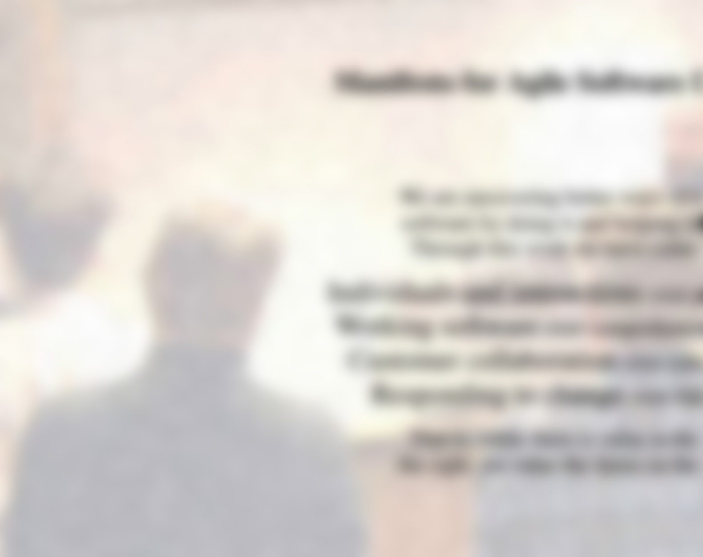
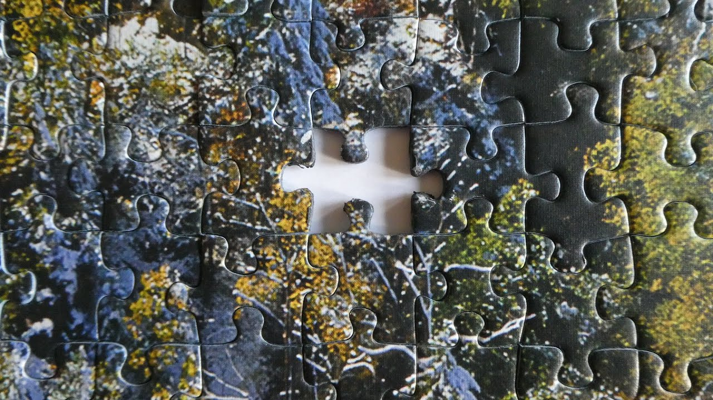
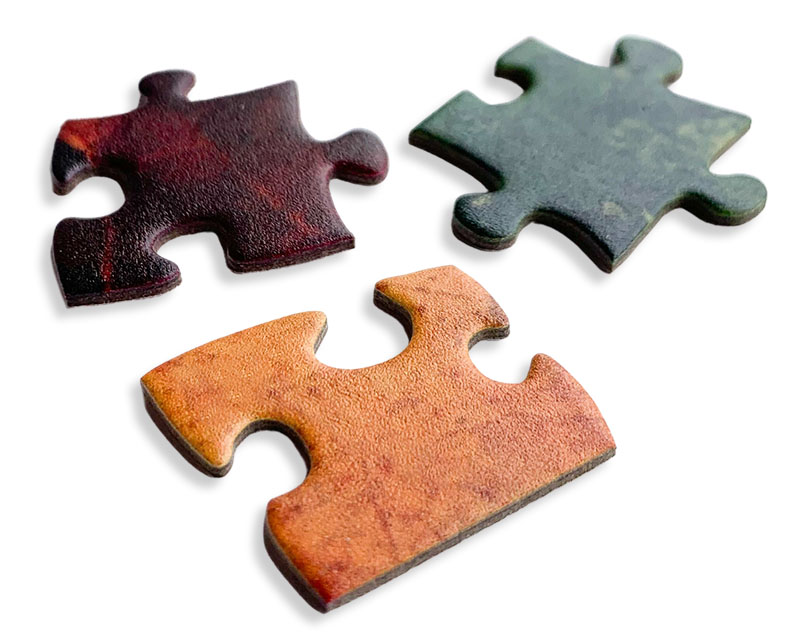
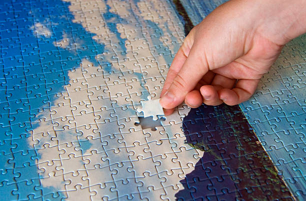

<h1>Humility</h1>
<h2>A Brain Hack for Creativity</h2>

---

## My favorite part of the agile manifesto?

---

# Uncovering better ways

> We are **uncovering better ways** of developing
software by doing it and helping others do it.

---

# Scenario: jigsaw puzzle

---

# Scenario: jigsaw puzzle

---

# Scenario: jigsaw puzzle

---

# "My puzzle is complete"

After **I've put the last piece in**, I'm **not interested** in your found puzzle piece

---

# "I'm missing something"

When I'm **looking for the last piece**, I'm **very interested** in your found puzzle piece

---

# A "Missing Piece" attitude

We **care more** about **learning** when **we believe there is something to learn**

---

# Humility

We believe there is something to learn

---

# Humility is a brain hack

When we think we are missing a piece

We trick our brain into looking for the missing piece

---

# Hubris is an anesthetic

When we think "my way is best"

We trick our brain into devaluing new information

---

# Humility vs Hubris

Humility causes us to put a higher value on new ideas

---

# Uncovering better ways

This happens best when  
we do not believe   
we're the best

---

## Do you think the Hunter Way Is Best?

    
    

---

# Are you looking for a better way?

    
    

---

# Suggestion

Pick a "learning mode phrase" and practice saying (or thinking it)

See if you find yourself more curious and creative to uncover better ways

---

### Phrases to put our brain in "learning mode"

- There are pieces missing from my puzzle
- There must be a better way
- I wonder what we're missing?
- I hate it; let's try it!
- Tell me more!
  
---

### Phrases to put our brain in "learning mode"
- That seems foolish to me; I wonder what I'm missing?
- This is good — can we do better?
- That's similar to what I do — can I tune my approach?
- I'd like to learn
- Surprise me!

