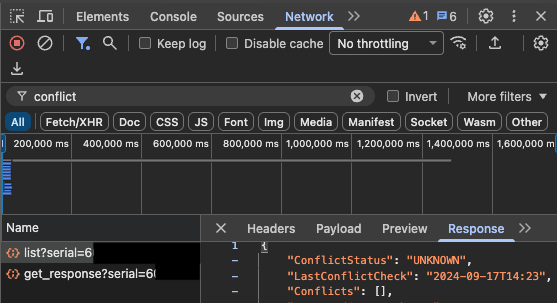

<h1>Ode to the API</h1>

---

---

# Ode to the API (I)

O seam 'tween the stacks  
O abstraction extraordinaire

How I love the ease
of seeing what's going on in there

---

# The API as...
### The Best Debugging Seam

|                             | ... |
|-----------------------------|-----|
| db                          |     |
| backend code (with logging) |     |
| backend code (no logging)   |     |
| API                         |     |
| frontend code               |     |

---

# The API as...
### The Best Debugging Seam

|                             | how to inspect                          |
|-----------------------------|-----------------------------------------|
| db                          | db browser                              |
| backend code (with logging) | CloudWatch                              |
| backend code (no logging)   | redeploy with logging, then CloudWatch  |
| API                         | network tab                             |
| frontend code               | browser debugger (must replay incident) |

---

# The API as...
### The Best Debugging Seam

- Every other part of the stack requires
  - special instrumentation
  - another tool to inspect
  - redeploying
  - re-creating the incident
   
---

# The API as...
### The Best Debugging Seam

- Every other part of the stack requires
  - special instrumentation
  - another tool to inspect
  - redeploying
  - re-creating the incident
- The API request response
  - always available in the network tab

---

### The Network Tab

- request
  - path, headers, body
- response
  - status, headers, body
  
---

# Ode to the API

The API is
- The best debugging seam

---

---

# Ode to the API (II)

O pithy expression of
irrigation quintessence 

You are the distillation
Of customers' impatience

---

# The API as...
### A Domain Abstraction

- Backend to UI in domain terms
  - 
  - 
- UI to backend in domain terms
  - 
  - 
   
---

# The API as...
### A Domain Abstraction

- Backend to UI in domain terms
  - Isolates db schema from UI quirks
  - 
- UI to backend in domain terms
  - Isolates UI from db schema
  - 

---

# The API as...
### A Domain Abstraction

- Backend to UI in domain terms
  - Isolates db schema from UI quirks
  - UI - specific to customer workflow
- UI to backend in domain terms
  - Isolates UI from db schema
  - backend - specific to device firmware
  
---

# The API as...
### A Domain Abstraction

- Do you want to rearchitect the backend
  - when we get a change in the customer flow from Gary
  
---

# The API as...
### A Domain Abstraction

- Do you want to rearchitect the backend
  - when we get a change in the customer flow from Gary
- Do you want to change the UI
  - when we restructure the backend?

---

# The API as...
### A Domain Abstraction

- Do you want to rearchitect the backend
  - when we get a change in the customer flow from Gary
- Do you want to change the UI
  - when we restructure the backend?
- If we have a 1:1:1 relationship UI:API:Backend, then
  - a change in one is a change throughout
---

# The API as...
### A Domain Abstraction

- The API is the in between place
- Where we can express the domain ideas
- In a structured format
- Independent of the constraints of
- UI workflow or backend implementation

---

# Ode to the API

The API is
- The best debugging seam
- An opportunity for a domain abstraction

---

---

# Ode to the API (III)

O declaration of intent
O expression of purpose

You sea-slammed precipice
Are unmoved by the superfluous

---

# The API as...
### A more permanent interface

- in the UI, we can easily refactor methods
- in the backend, we can easily refactor methods

---

# The API as...
### A more permanent interface

- in the UI, we can easily refactor methods
- in the backend, we can easily refactor methods
- API endpoints cannot be easily changed

---

# The API as...
### A more permanent interface

- to change an API endpoint contract
  - callers must change (Angular)
  - infrastructure must change (API Gateway)
  - maybe backend code must change (lambda)
- 

---

# The API as...
### A more permanent interface

- to change an API endpoint contract
  - callers must change (Angular)
  - infrastructure must change (API Gateway)
  - maybe backend code must change (lambda)
- Methods/classes in one layer are much easier to change

---

# Aside: API contract change

The API Contract is more than shape. It includes:

- the path
- the request/response shape
- the behavior (given input X, we'll have behavior Y)

---

# Ode to the API

The API is
- The best debugging seam
- An opportunity for a domain abstraction
- More expensive to change than classes/functions

---

# Comparison

API Design vs Class/Function Design

- More value
  - debugging seam
  - opportunity for domain abstraction
- Higher cost to change

---

# Alex's Advice

Treat API design differently than we do function/class design.

---

# Alex's Advice

Treat API design differently than we do function/class design.

Spend more care in designing APIs than designing functions/classes.

---

# Alex's Advice

Treat API design differently than we do function/class design.

Spend more care in designing APIs than designing functions/classes.

Protect, express, and communicate about our API design more than we would with function/class design.

---

---

# Ode to the API

O seam 'tween the stacks  
O abstraction extraordinaire

How I love the ease
of seeing what's going on in there

---

# Ode to the API

O pithy expression of
irrigation quintessence

You are the distillation
Of customers' impatience

---

# Ode to the API

O declaration of intent
O expression of purpose

You sea-slammed precipice
Are unmoved by the superfluous

---

# Ode to the API

The API warrants more careful design because it is
- The best debugging seam
- An opportunity for a domain abstraction
- More expensive to change than classes/functions

---

